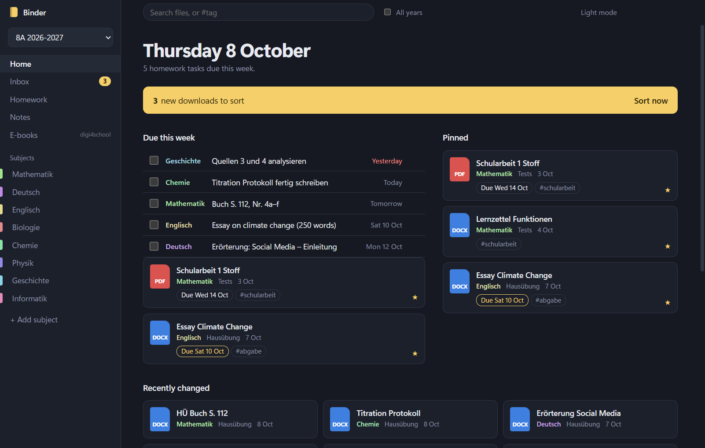
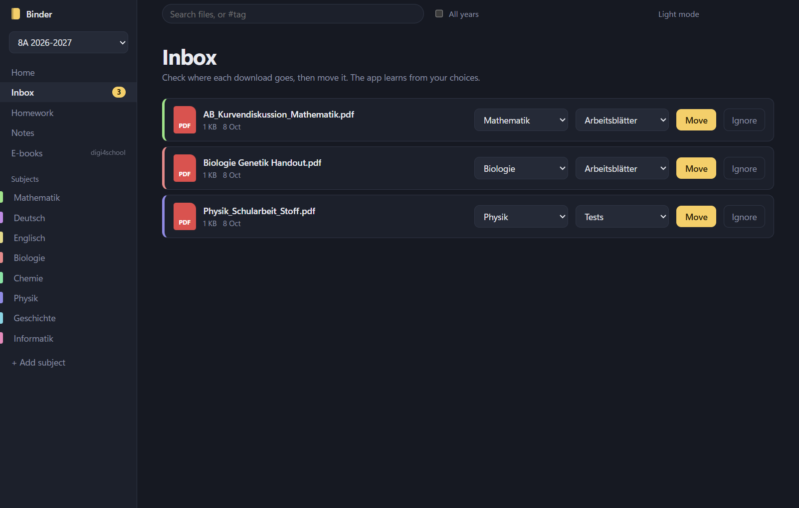
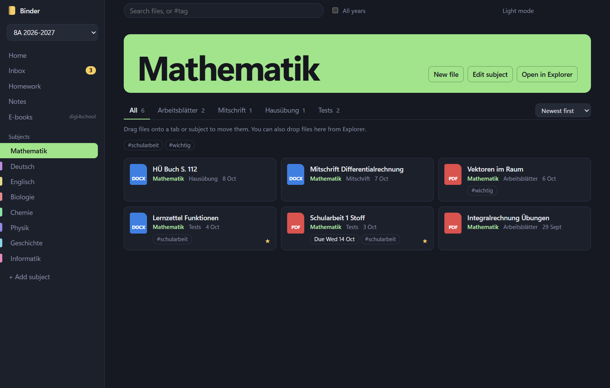
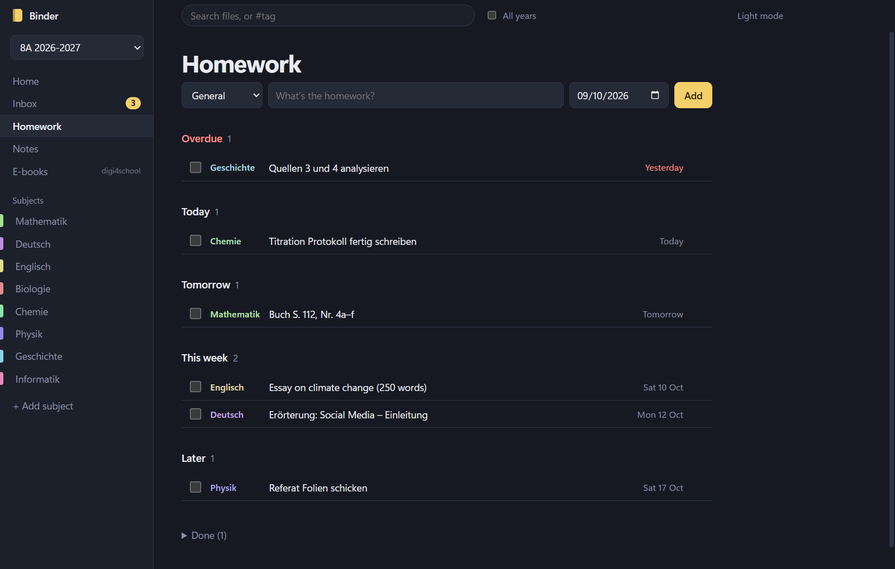
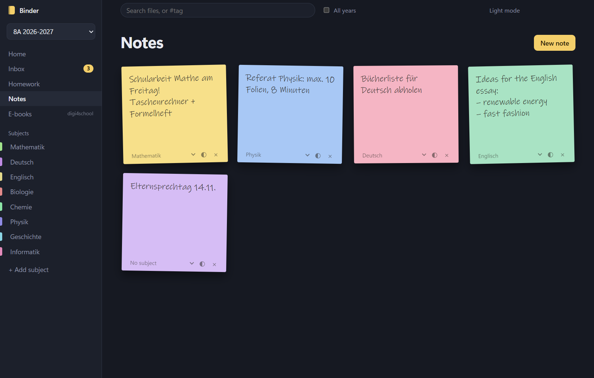
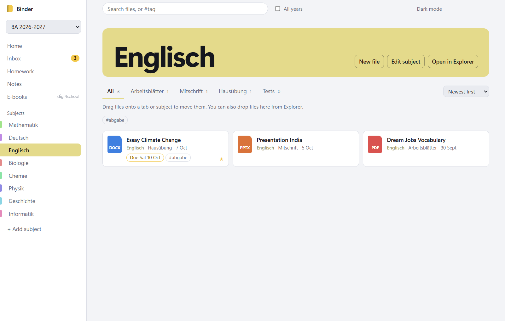
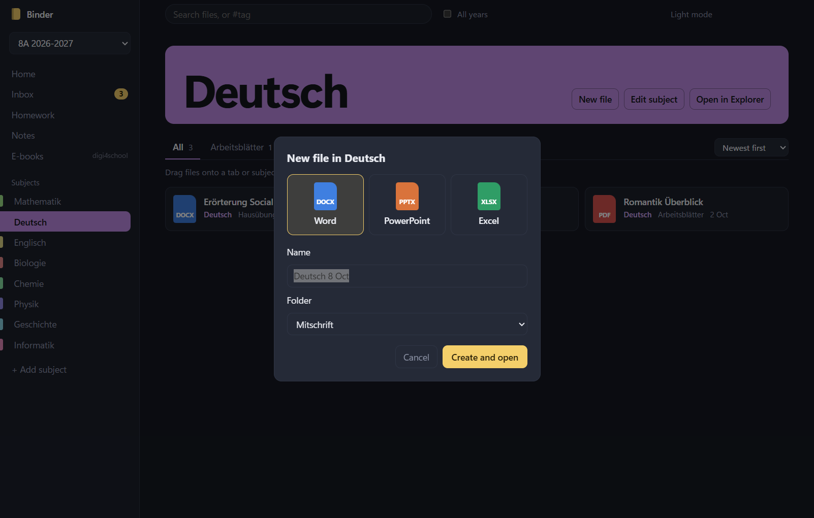

<p align="center">
  
</p>

<h1 align="center">Binder</h1>

<p align="center">
  A desktop app for Windows that keeps your school files in order.<br>
  Downloads from Moodle get sorted into the right subject, and homework, notes and deadlines live next to your files.
</p>

<p align="center">
  
</p>

## Why

School files end up everywhere: worksheets in Downloads, Word documents on the desktop, presentations in random folders. Binder gives every subject its own place in a normal folder in your Documents and helps you get files there. Because everything stays in plain Windows folders, Explorer, Word, PowerPoint and OneDrive keep working as before.

## Features

### Inbox: downloads sort themselves
Binder watches your Downloads folder. New PDFs, Word, PowerPoint and Excel files show up in the Inbox, each with a suggested subject and type. Click **Move** and the file goes into the right folder. Binder learns from your choices, so its suggestions get better over time.



### Subjects with their own colour and folders
Each subject has a folder with tabs for **Arbeitsblätter**, **Mitschrift**, **Hausübung** and **Tests**. Click a file to open it in Word, PowerPoint or your PDF reader.

- Drag files onto a tab or subject to move them, or drop files straight from Explorer.
- Rename subjects, change their colour, drag them into your own order, or delete them (to the Recycle Bin).
- Sort by date, by name, or into your own order.
- Pin important files and give them tags and due dates.
- Create a new Word, PowerPoint or Excel file in the right folder with one click.



### Homework planner
Write down homework as you get it. Binder sorts it into Overdue, Today, Tomorrow, This week and Later, and the home screen shows what's due this week.



### Sticky notes
For things that don't belong in a folder: reminders, ideas, the date of the next parents' evening.



### And also
- **Search** across one school year or all of them (`Ctrl+F`), including `#tag` search.
- **School years**: every year gets its own folder (for example `8A_2026-2027`). Older years stay browsable as an archive.
- **Light and dark mode.**
- **E-books**: opens your [Digi4School Offline](https://github.com/Combustion-Robotics/digi4school-downloader) (private for now) library, if you use it in Brave, Chrome or Edge.

<p>
  
  
</p>

## Download

Get the latest version from **[Releases](https://github.com/Combustion-Robotics/binder/releases/latest)**:

| System | File |
|---|---|
| Windows (most PCs) | `Binder-…-win-x64.exe` |
| Windows on ARM | `Binder-…-win-arm64.exe` |
| Linux, any distribution | `Binder-…-linux-x86_64.AppImage` / `…-arm64.AppImage` |
| Debian / Ubuntu / Mint | `Binder-…-linux-amd64.deb` / `…-arm64.deb` |

The Windows installer isn't code-signed, so SmartScreen may warn you: click **More info → Run anyway**. Binder is made for Windows. The Linux builds are new: **New file** creates an empty document there (Office templates are Windows-only), and the E-books button only finds Digi4School Offline on Windows.

## Run from source

You need [Node.js](https://nodejs.org) 18 or newer.

```bash
git clone https://github.com/Combustion-Robotics/binder.git
cd binder
npm install
npm start
```

On Windows this also puts a **Binder** shortcut on your desktop and in the Start menu, so you don't need the terminal again. Keep the cloned folder where it is: the shortcuts point to it.

To build the installers yourself: `npm run dist:win` (on Windows) or `npm run dist:linux` (on Linux). Pushing a tag like `v1.0.1` builds both on GitHub Actions and publishes a release.

## First start

Binder:

- creates a folder for the current school year in your Documents. If last year's folder exists (for example `7A_2025-2026`), the new one is named after it (`8A_2026-2027`) and gets the same subjects.
- offers the downloads from the last 7 days in the Inbox.

## Where your data is

| What | Where |
|---|---|
| Your files | `Documents\<year>\<subject>\<type>`: normal folders you can also use in Explorer |
| Homework, notes, pins, tags, colours, settings | `%APPDATA%\Binder\data.json` (Linux: `~/.config/Binder/data.json`) |

Binder never uploads anything. Deleting a subject moves its folder to the Recycle Bin.

## Development

The app is plain Electron with no build step and no framework:

| File | What it does |
|---|---|
| `main.js` | Window, Downloads watcher, all file operations, `data.json` |
| `preload.js` | The bridge between the page and `main.js` |
| `index.html`, `app.js`, `app.css` | The interface |

To try Binder without touching your real files, give it its own Documents, Downloads and data folder:

```bash
set BINDER_HOME=C:\Temp\binder-demo
npm start
```

## License

Binder is source-available under the [PolyForm Noncommercial License 1.0.0](LICENSE.md).

- ✅ You may use, study and change it for personal, school and other noncommercial purposes, and share it noncommercially.
- ❌ You may not sell it, use it commercially, or remove the copyright notice and pass it off as your own.

Copyright (c) 2026 Combustion-Robotics. For commercial use, ask the author.
